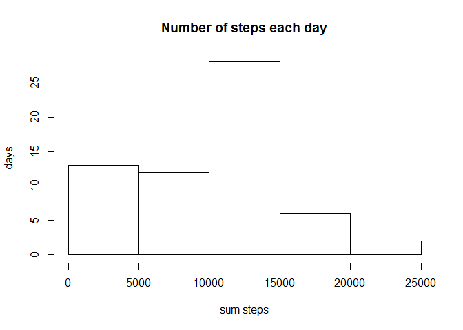
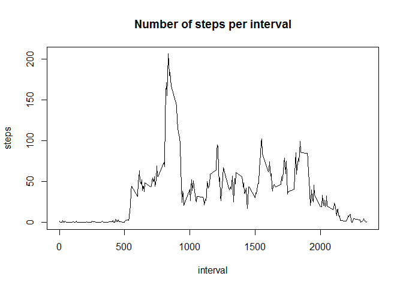
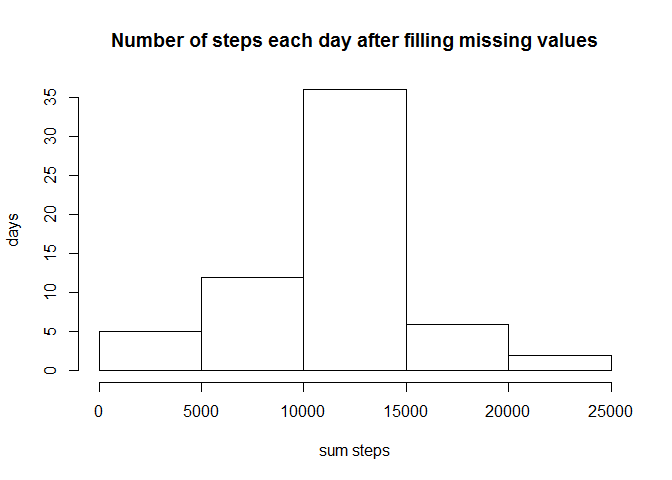
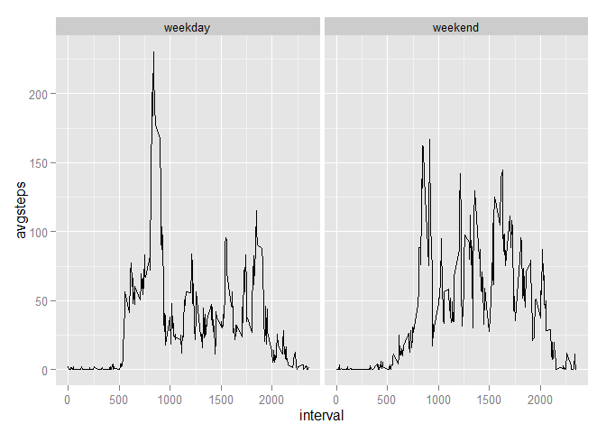

# Reproducible Research: Peer Assessment 1


## Loading and preprocessing the data
1. Load the data 
2. Process/transform the data (if necessary) into a format suitable for your analysis

```r
  download.file("https://d396qusza40orc.cloudfront.net/repdata%2Fdata%2Factivity.zip","activity.zip")
  unzip("activity.zip")
  acts<-read.csv("activity.csv")
  library(dplyr)
```

```
## 
## Attaching package: 'dplyr'
## 
## The following objects are masked from 'package:stats':
## 
##     filter, lag
## 
## The following objects are masked from 'package:base':
## 
##     intersect, setdiff, setequal, union
```
  
## What is mean total number of steps taken per day?
1. Make a histogram of the total number of steps taken each day
2. Calculate and report the mean and median total number of steps taken per day  
=> sum steps by date

```r
  stepsperday<-summarise(group_by(acts,date),sumsteps=sum(steps,na.rm=TRUE))
  hist(stepsperday$sumsteps,xlab='sum steps',ylab='days',main='Number of steps each day')
```

 

```r
  meanstepsperday<-format(mean(stepsperday$sumsteps))
  medianstepsperday<-median(stepsperday$sumsteps)
```
Calculated mean total steps per day: **9354.23**   
Calculated median total steps per day: **10395** 
  
## What is the average daily activity pattern?
1. Make a time series plot of the 5-minute interval (x-axis) and the average number of steps taken, averaged across all days (y-axis)  
=> take mean steps by intervale 

```r
  stepsperinterval<-summarise(group_by(acts,interval),avgsteps=mean(steps,na.rm=TRUE))
  plot(stepsperinterval$interval,stepsperinterval$avgsteps,type="l", xlab='interval',ylab='steps',main='Number of steps per interval')
```

 

2. Which 5-minute interval, on average across all the days in the dataset, contains the maximum number of steps?

```r
  intervalmaxsteps<-subset(stepsperinterval, avgsteps==max(stepsperinterval$avgsteps))
```
5-minute Interval with the maximum number of steps across all data in the dataset: **835** 
  
## Imputing missing values
1. Calculate and report the total number of missing values in the dataset

```r
  misval<-sum(is.na(acts$steps))
```
Total number of missing values in the dataset: **2304**

2. Devise a strategy for filling in all of the missing values in the dataset. 
3. Create a new dataset that is equal to the original dataset but with the missing data filled in.  
=> copy dataset, fill missing values with the allready calculated mean of the corresponding interval. (calculated above in 'stepsperinterval') 

```r
  actsfilled<-acts
  for (i in 1:nrow(acts)) if (is.na(actsfilled$steps[i])) actsfilled$steps[i]=stepsperinterval$avgsteps[stepsperinterval$interval==actsfilled$interval[i]]
```

4. Make a histogram of the total number of steps taken each day and calculate and report the mean and median total number of steps taken per day. Do these values differ from the estimates from the first part of the assignment?
What is the impact of imputing missing data on the estimates of the total daily number of steps?

```r
  stepsperday2<-summarise(group_by(actsfilled,date),sumsteps=sum(steps,na.rm=TRUE))
  hist(stepsperday2$sumsteps,xlab='sum steps',ylab='days',main='Number of steps each day after filling missing values')
```

 


```r
  meanstepsperday2<-format(mean(stepsperday2$sumsteps))
  medianstepsperday2<-format(median(stepsperday2$sumsteps))
```
Calculated mean total steps per day after imputing missing data: **10766.19** (Before: **9354.23**)  
Calculated median total steps per day after imputing missinmg data: **10766.19** (Before: **10395**) 

## Are there differences in activity patterns between weekdays and weekends?
1. Create a new factor variable in the dataset with two levels 'weekday' and
'weekend' indicating whether a given date is a weekday or weekend day.  
=> add column 'daytype' with value "weekday", change "weekday to "weekend" of weekday = 1 (sunday) or 7 (saturday). 

```r
  library("lubridate")
  actsfilled$daytype<-"weekday"
  actsfilled$daytype[wday(actsfilled$date)==1]<-"weekend"
  actsfilled$daytype[wday(actsfilled$date)==7]<-"weekend"
```

2. Make a panel plot containing a time series plot of the 5-minute interval (x-axis) and the average number of steps taken, averaged
across all weekday days or weekend days (y-axis).

```r
  library("ggplot2")  
  par(mfrow=c(1,1))  
  stepsperinterval2<-summarise(group_by(actsfilled,interval,daytype),avgsteps=mean(steps,na.rm=TRUE))
  ggplot(stepsperinterval2)+aes(interval,avgsteps)+geom_line()+facet_grid(~daytype)
```

 
